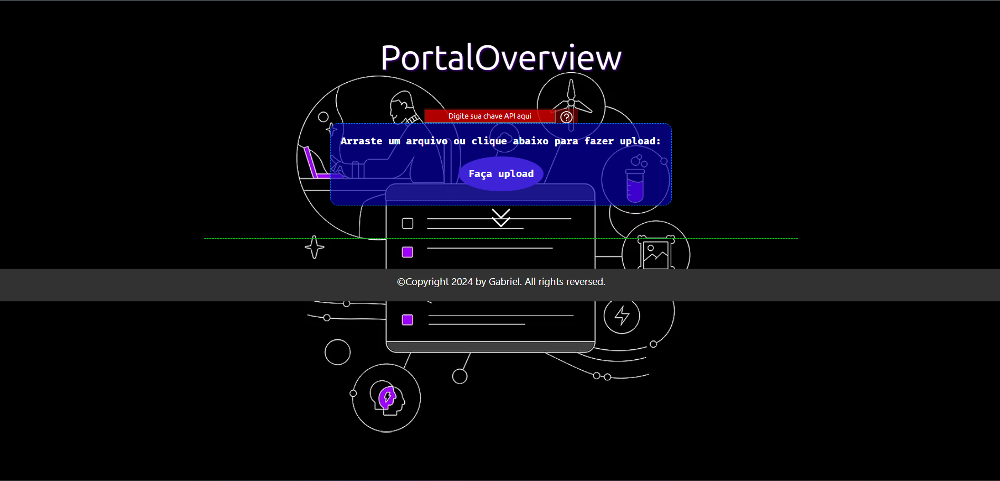

# PortalOverview

## Sobre o Projeto

Este projeto foi desenvolvido como parte do curso "Imersão Inteligência Artificial 2ª Edição" da Alura em parceria com o Google. O objetivo do projeto é criar um site para gerar resumos de arquivos PDF utilizando a API do Google AI Studio.

## Funcionalidades

- Fácil geração de resumos a partir de arquivos PDF.
- Utilização da tecnologia de Processamento de Linguagem Natural (NLP) para criar resumos precisos e concisos divididos em tópicos.
- Interface intuitiva e amigável para facilitar a interação dos usuários.
- Compatibilidade com Arquivos PDF: O código é capaz de extrair texto de arquivos PDF, tornando-o compatível com uma variedade de formatos de documentos amplamente utilizados.
- Personalização da Temperatura de Geração: Os usuários têm a opção de personalizar a temperatura de geração dos resumos, permitindo ajustar o equilíbrio entre a criatividade e a precisão do texto gerado.
- Configurações de Segurança Ajustáveis: O código permite ajustar as configurações de segurança para controlar o nível de filtragem de conteúdo potencialmente prejudicial, como discurso de ódio, assédio, conteúdo sexualmente explícito e conteúdo perigoso.
- 

## Como Utilizar

1. Faça o download ou clone este repositório para sua máquina local.
2. Certifique-se de ter uma chave de API válida do Google AI Studio.
3. Instale as dependências do projeto utilizando `pip install -r requirements.txt`.
4. Execute o servidor Flask com o comando `python app.py`.
5. Acesse o site através do navegador abrindo o arquivo index.html.

## Configuração da Chave de API

Para utilizar a API do Google AI Studio, é necessário configurar uma chave de API válida. Siga as instruções abaixo para obter sua chave de API:

1. Acesse a [Google Cloud Console](https://console.cloud.google.com/).
2. Crie um novo projeto ou selecione um projeto existente.
3. Ative a API de Processamento de Linguagem Natural (NLP) no painel de controle do Google Cloud.
4. Crie uma chave de API para a API do Google AI Studio.
5. Cole a chave de API no arquivo de configuração do projeto ou defina-a como uma variável de ambiente.
   
## Contato

Para mais informações sobre o projeto, entre em contato com Gabriel Costa via gabrielcostademoraes13@gmail.com
